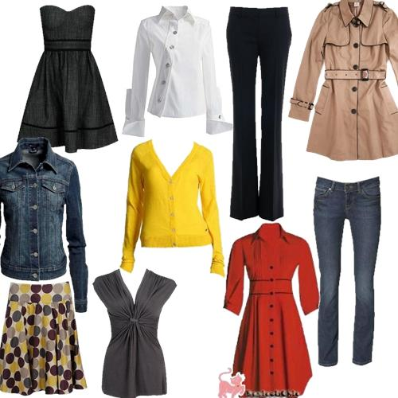

<!doctype html>
<html lang="pt-br">
  <head>
    
    <title>Armazem WW</title>
      
    <!-- Required meta tags -->
    <meta charset="utf-8">
    <meta name="viewport" content="width=device-width, initial-scale=1, shrink-to-fit=no">

    <!-- Bootstrap CSS -->
    <link rel="stylesheet" href="node_modules/bootstrap/compiler/bootstrap.css">
      
    <link rel="stylesheet" href="style/css/style.css">
      
    <link rel="stylesheet" href="node_modules/font-awesome/css/font-awesome.css">
      
  </head>
  <body>
      
        
      <nav class="navbar navbar-expand-lg navbar-dark bg-gradient-primary">
          
        

      
            <a class="navbar-brand h1 mb-0" href="#">Armazem ww</a>

            <button class="navbar-toggler" type="button" data-toggle="collapse" data-target="#navbarSite">
              
            </button>

            

                
                
                <ul class="navbar-nav ml-auto">
                
                    <li class="nav-item dropdown">
                    
                        <a class="nav-link dropdown-toggle" href="#" data-toggle="dropdown" id="navDrop">
                            Social
                        </a>
                        

                            <a class="dropdown-item" href="#">Facebook</a>
                            <a class="dropdown-item" href="#">Twitter</a>
                            <a class="dropdown-item" href="#">Instagram</a>
                        

                    
                    </li>
                
                </ul>
                
                <form class="form-inline">
                    <input class="form-control ml-4 mr-2" type="search" placeholder="Buscar...">
                    <button class="btn btn-dark" type="Submit">Ok</button>
                </form>

            

            
        

      
      </nav>
      
      

      
        <ol class="carousel-indicators">
          <li data-target="#carouselSite" data-slide-to="0" class="active"></li>
          <li data-target="#carouselSite" data-slide-to="1"></li>
          <li data-target="#carouselSite" data-slide-to="2"></li>
		  <li data-target="#carouselSite" data-slide-to="3"></li>
		  <li data-target="#carouselSite" data-slide-to="4"></li>
        </ol>
          
        

        
            

            
                
                
                

                
                    <h1>Armazens WW</h1>
                    
Fardos Diverços

                
                

            
            

            
            

            
                
                
                

                
                    <h1>Armazens WW</h1>
                    
Fardos Diverços .

                
                

            
            

            
            

            
                
                
                

                
                    <h1>Rouras para homens</h1>
                    
calças, camisas, camisetes, camisolas, roupa. interior, calçado.

                
                

            
            

			

            
                
                
                

                
                    <h1>Roupa para mulheres</h1>
                    
saias, Vestidos, calças, camisas, camisetes, camisolas, roupa. interior, calçado.

                
                

            
            

			

            
                
                
                

                
                    <h1>Roupa para crianças</h1>
                    
saias, Vestidos, calças, camisas, camisetes, camisolas, roupa. interior, calçado.

                
                

            
            

          
        

          
        <a class="carousel-control-prev" href="#carouselSite" role="button" data-slide="prev">
          
            
            Anterior
            
        </a>
        <a class="carousel-control-next" href="#carouselSite" role="button" data-slide="next">
        
            
            Avançar
        
        </a>
      
      

      
      
      

      
          

          
              

              
                  <h1 class="display-3"><i class="fa fa-cogs text-primary" aria-hidden="true"></i> Armazem de Vestuario WW</h1>
                  
Roupas usadas de qualidade Superior e para todas idades.

              
              

          
          

          
          

          
            

              
                <nav id="navbarVertical" class="navbar navbar-light bg-light">
                
                    <nav class="nav nav-pills flex-column">
                    
                        <a class="nav-link" href="#item1">Tipo de Fardos</a>
                        
                        <nav class="nav nav-pills flex-column">
                        
                            <a class="nav-link ml-3" href="#item1-1">Roupas para adultos</a>
                            
                            <a class="nav-link ml-3" href="#item1-2">Roupas para criancas</a>
                        
                        </nav>
                        
                        <a class="nav-link my-2" href="#item2">Roupa Femenina</a>
                        
                        <a class="nav-link my-2" href="#item3">Roupa Masculina</a>
                        
                        <nav class="nav nav-pills flex-column">
                        
                            <a class="nav-link ml-3" href="#item3-1">Roupas Despotivas</a>
                            
                            <a class="nav-link ml-3" href="#item3-2">Calçado</a>
							<a class="nav-link ml-3" href="#item3-2">Artigos divesos</a>
                        
                        </nav>
                    
                    </nav>
                
                </nav>  
              
            

              
            

              
                

                
                    <h4 id="item1">Roupas para todos</h4>
                    
Temos ropas para todas idades, gostos, estilos. Os nossos produtos sao de alta qualidade e precos acessiveis. Temos tambem roupas para todas as ocasioes e estacoes de ano. tamto para verao como ra o inverno

                    
                    <h5 id="item1-1">Roupas para Adultos</h5>
                    
As nossas roupas sao previamente selecionadas, para garantir que os nossos clientes tenha roupas usadas e em bom estado. Temos fatos, calcas, Roupa de quarto, roupa de cama, mantas, calcoes e muito mais 

                    
                    <h5 id="item1-2">Roupas para criancas</h5>
                    
  Agora ficou fácil montar um look fofo para os pequenos. Aqui você encontra peças lindas, seguras e confortáveis que vão dar vontade de apertar o filhote de tanta gostosura. 
						
						É hora de renovar o look da criançada! Na Dafiti você encontra as principais
						peças de roupa infantil para a criançada manter o estilo nas alturas. Para a linha de roupa infantil menina, os casaquinhos clássicos dão um toque de elegância às produções mirins.
						os de roupa infantil da Dafiti atende a todas as necessidades da criança!

                    
                    <h4 id="item2">Roupa Femenina</h4>
                    
 O guarda-roupa feminino é um universo a parte no mundo da moda, são peças e mais peças de roupas para todos os estilos, gostos e ocasiões. As roupas femininas são versáteis, todos os modelos pode mudar seu estilo de acordo com a peça com a qual é combinada.

						Roupas da Moda
						Encontrem na Dafiti roupas femininas das melhores marcas, com os melhores preços e excelentes condições de pagamento, como o parcelamento em até 10x. Comprar roupas femininas na Dafiti é seguro e prático, e as compras chegam rapidamente no conforto de sua casa.

						Confira nossas roupas femininas baratas em nosso outlet e fique por dentro das melhores liquidações de roupas femininas!.

                    
                    <h4 id="item3">Roupas Masculinas</h4>
                    
A coleção de roupas masculinas da Armazens WW conta com opções contemporâneas que vão agradar todos os estilos. Em nosso departamento, você encontra blusas masculinas, calças, bermudas, jaquetas, casacos e relogios masculinos.

						Seja para o dia a dia ou até mesmo para situações mais formais que pedem por produções mais elaboradas, no site da Armazem WW você encontra peças de todos os estilos e que combinam com você. Para finalizar essas produções, nada melhor que um bom acessório, tendência certeira na moda masculina. Na Renner, você encontra colares, pulseiras, bonés e cintos.

                    <h5 id="item3-1">Roupas Despotiva</h5>
                    
Poderá encontrar na WW Fardos com uma vasta gama de Roupa de Desporto para Homem com descontos fantásticos. Desde calças de deporto, fatos de treino, calções, sweats, t-shirts, lote de meias, calções de banho, blusões com capuz até slips de banho. Como sempre, a La Redoute tem uma política de devolução de 15 dias após a compra. Aproveite as promoções La Redoute e compre a um preço fantástico

                    <h5 id="item3-2">Calçado</h5>
                    
Dispomos de uma grande variedade de marcas de calçado. Fornecemos fardos com sapatos para crianças e adultos.Sapatos para crianças , conhecida por ser da confiança de já várias gerações de pais pela produção de calçado de qualidade, acompanhando assim cada etapa do desenvolvimento do seu filho, oferecendo o conforto e protecção necessários ao longo de todo o caminho.

                
  
              
            

          
          

          
          

          
              

              
                  

                        
                      
                      

                        <h4 class="card-title">Calçados diversos</h4>
                        <h6 class="card-subtitle mb-2 text-muted">Sapatos, sandalias e patilhas</h6>
                        
calcado divercificado.

                      

                      
                  

              
              

              
              

              
                  

                        
                      
                      

                        <h4 class="card-title">Toalhas</h4>
                        <h6 class="card-subtitle mb-2 text-muted">Toalhas e acessorioa Variados</h6>
                        
Varedade de utencilios 

                      

                     
                      
                  
                  

              
              

              
              

              
                  

                        
                      
                      

                        <h4 class="card-title">Roupa de Cama </h4>
                        <h6 class="card-subtitle mb-2 text-muted">Mantas, lencois</h6>
                        
fronhas, Cobertores, .

                      

                      
              
                  

              
              

          
          

      
      

      
      

      
       
          
      

      
          

          
              

              
                  <h1 class="display-4"><i class="fa fa-paper-plane text-primary" aria-hidden="true"></i> Interaja connosco</h1>
              
              

          
          

          
          

          
            

            
                <form>
                
                    

                        
                        

                    
                            <label for="inputNome">Seu nome</label>
                            <input type="text" class="form-control" id="inputNome" placeholder="Nome">
                            
                        

                        
                        

                        
                            <label for="inputSobrenome">Seu sobrenome</label>
                            <input type="text" class="form-control" id="inputSobrenome" placeholder="Sobrenome">
                        
                        

                        
                    

                    
                    

                        
                        

                        
                            <label for="inputEnd">Seu endereço</label>
                            <input type="text" class="form-control" id="inputEnd" placeholder="Endereço completo">
                        
                        

                        
                    

                    
                    

                        
                        

                        
                            <label for="inputCidade">Cidade</label>
                            <input type="text" class="form-control" id="inputCidade" placeholder="Cidade">
                        
                        

                        
                        
                        
                        

                        
                            <label for="inputCEP">Contacto</label>
                            <input type="text" id="inputContacto" class="form-control">
                        
                        

                    
                    

                    
                    

                    
                        

                        
                            

                            
                                <label class="form-check-label">
                                    <input class="form-check-input" type="checkbox"> Desejo receber novidades por e-mail
                                </label>
                            
                            

                        
                        

                    
                    

                    
                    

                    
                        

                        
                            <button type="submit" class="btn btn-primary">Enviar</button>
                            
                            <a tabindex="0" class="btn btn-secondary ml-2" role="button" data-toggle="popover" data-placement="right" data-trigger="focus" title="Caro utente " data-content="para contactarno e fazer reservas leia e preencha os campos seguindo as instrucoes ou contacte nos atraves dos concacto abaixi.">Ajuda</a>
                        
                        

                    
                    

                
                </form>
              
            

          
          

          
          

          
              

              
              

              
                  <h3>Armazens WW</h3>
                  
O Armazém de Vestuários & Acessórios W.W. é uma organização que se dedica à venda de fardos de roupas usadas, calçados usados e de outros acessórios de roupas usados. Os fardos vêem da Austrália e Europa. Cada fardo contém um tipo específico de peça (como: vestidos, calças jeans, sapatos, sapatilhas, calções, blusas, cintos e outros).

              
              

              
              

              
                  <h3>Menu</h3>
                  
                  

                    <a href="#" class="list-group-item list-group-item-action list-group-item-primary">Lojas</a>
                    <a href="#" class="list-group-item list-group-item-action list-group-item-primary">Serviços</a>
                    <a href="#" class="list-group-item list-group-item-action list-group-item-primary"> Horarios</a>
                    <a href="#" class="list-group-item list-group-item-action list-group-item-primary">Contatos</a>
                  

              
              

              
              

              
                  <h3>Social</h3>
                  
                  

                    <a class="btn btn-outline-primary" href="#"><i class="fa fa-facebook-official" aria-hidden="true"></i> Facebook</a>
                    <a class="btn btn-outline-info" href="#"><i class="fa fa-twitter-square" aria-hidden="true"></i> Twitter</a>
                    <a class="btn btn-outline-warning" href="#"><i class="fa fa-instagram" aria-hidden="true"></i> Instagram</a>
                  

              
              

              
              

              
                <blockquote class="blockquote text-center">
                
                    
Visete o armazem ww na avenida de Namacha 1520, Maputo. ou contacte pelos Telefones 8455562 e 86021236.

                    <footer class="blockquote-footer">Lojas WW<cite title="Titulo"> F</cite></footer>
                    
                </blockquote>
              
              

          
          

      
      

      
    <!-- Modal -->
    

        

            

            
                

                    <h5 class="modal-title">Fusce ac cursus nisi</h5>
                    <button type="button" class="close" data-dismiss="modal">
                        &times;
                    </button>
                

                
                

                    
                    

                    
                        

                        
                            

                                
                                <h5>Armazens WW</h5>
                            
                                

                            

                            
                            

                            
                                <h5>Donec semper</h5>
                            
                                

                            

                        
                        

                    
                    

                    
                

                
                

                    <button type="button" class="btn btn-danger" data-dismiss="modal">Armazens WW</button>
                

                
            

        

    

      
      
    <!-- Optional JavaScript -->
    <!-- jQuery first, then Popper.js, then Bootstrap JS -->
    
    
    
      
    

  </body>
</html>